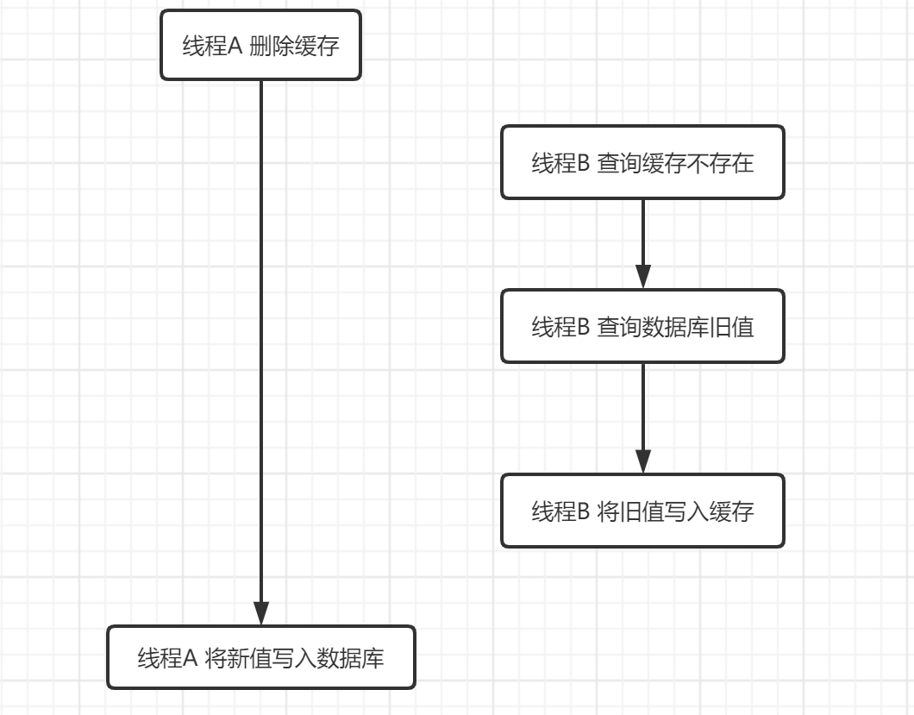
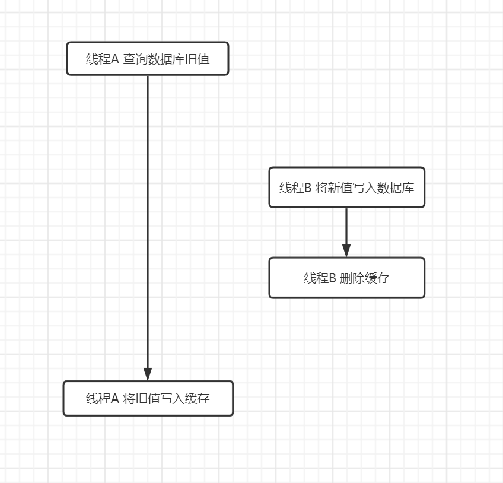

# 1、联表查询  多对一/一对多

```java
class CommentDomain {
    // 父级评论
    private CommentDomain parent;
    // 文章
    private ContentDomain article；
    //评论作者
    private UserDomain 
    ...
    
}
```


# 2、缓存

缓存导致更新和删除文章不生效的Bug（双写不一致问题）

扩展：读写不一致、双写不一致

> 读写不一致：读写不一致问题是在并发情况下，多个线程对同一个数据同时进行读取和写入操作，最后导致读写不一致。


比如这里我线程A查询缓存为空，那么就要查询数据库，查询数据库name为张三，然后我就要去更缓存name为张三。

但是这个时候线程B在线程A查询数据库之后，更新缓存之前修改了数据库的数据name为李四，但是缓存name还是张三，这里就出现数据库与缓存不一致的情况了。


> 双写不一致：两个线程都是写的操作，结果还是造成了数据库和缓存不一致的问题。


例如线程B在线程A写入数据后、更新缓存前，进行了数据的修改，但是最终修改缓存的还是线程A，所以这时数据库和缓存不一致。


解决方案：

1. 使用共享锁解决

2. 更新数据库和更新缓存顺序

   [Redis 双写一致性 - 明叶师兄。 - 博客园 (cnblogs.com)](https://www.cnblogs.com/renxiuxing/p/14967390.html)


**先更新数据库，在更新缓存：**出现双写不一致问题，见上图


**先删缓存，再更新数据库：**



如果不采用给缓存设置过期时间策略，该数据永远都是脏数据。

解决方法：延时双删策略

1. 先淘汰缓存
2. 再写数据库（这两步和原来一样）
3. 休眠1秒，再次淘汰缓存 (将B线程写入缓存的值删除)


**先更新数据库，再删缓存：**

也有可能出现脏数据问题，如下图，但是出现概率极低，因为要求B线程写入操作快于线程A的读取操作，才能使A最终将脏数据写入缓存，但是数据库的读操作速度远大于写操作。




# 3、IP地址

0:0:0:0:0:0:0:1 为 IPv6 对应的本机ip地址

127.0.0.1 为 IPv4 对应的本机ip地址

本机 DNS域名解析 host文件 （存放位置：C:\Windows\System32\drivers\etc）中对 localhost  映射为0:0:0:0:0:0:0:1。

因此，使用Tomcat启动项目，并访问http://localhost:8080/ 时，获取的ip地址为 0:0:0:0:0:0:0:1。

若想获得IPv4，只需要访问 http://127.0.0.1:8080  

或者

修改host文件，增加一行

`127.0.0.1       localhost`

[Tomcat Servlet request.getRemoteAddr()所得值为0:0:0:0:0:0:0:1_Mr.Z@overflow的博客-CSDN博客_servletrequest.getremoteaddr](https://blog.csdn.net/taotaoyouarebaby/article/details/8742240?spm=1001.2101.3001.6650.1&utm_medium=distribute.pc_relevant.none-task-blog-2~default~CTRLIST~default-1-8742240-blog-107954374.pc_relevant_default&depth_1-utm_source=distribute.pc_relevant.none-task-blog-2~default~CTRLIST~default-1-8742240-blog-107954374.pc_relevant_default&utm_relevant_index=2)


若使用了反向代理软件，`request.getRemoteAddr()` 方法获取的ip地址为127.0.0.1，而无法直接获得真实ip地址，原因是经过代理以后，由于在客户端和服务之间增加了中间层，当我们访

问反向代理url/index.jsp 时，其实并不是我们浏览器真正访问到了服务器上的index.jsp文件，

而是先由代理服务器去访问 真实url/index.jsp ，代理服务器再将访问到的结果返回给我们的浏览器，因为是代理服务器去访问index.jsp的，所以index.jsp中通过 request.getRemoteAddr() 的方法获取的IP实际上是代理服务器的地址，并不是客户端的IP地址。

但是在转发请求的HTTP头信息中，增加了X－FORWARDED－FOR信息，用以跟踪原有的客户端IP地址和原来客户端请求的服务器地址。可以通过该信息获得客户端真实ip